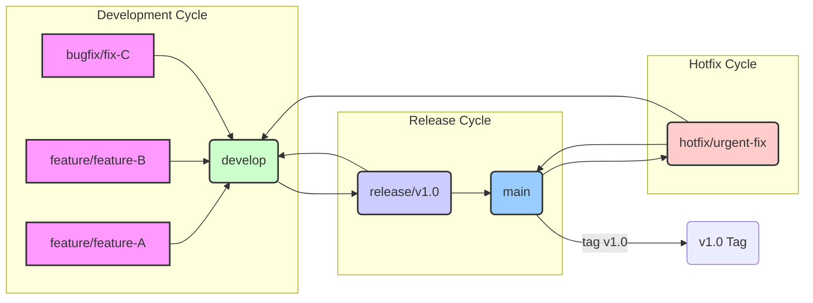

# Branching Strategy and Protection Rules

This document outlines the branching strategy used in the Transity project and the protection rules applied to key branches to ensure code quality and stability. This expands upon the information provided in the `CONTRIBUTING.md` file.

## Branch Strategy Overview

We utilize a branching model inspired by Gitflow, designed to manage feature development, releases, and hotfixes effectively.

### Branch Descriptions

*   **`main`**:
    *   **Purpose**: Represents the official, stable release history of the project. Only production-ready code resides here.
    *   **Source**: Merged from `release/*` branches upon successful release preparation or `hotfix/*` branches for urgent fixes.
    *   **Lifetime**: Permanent.
    *   **Protection**: Heavily protected. Direct commits are forbidden. Merges require successful CI checks and multiple approvals (typically).

*   **`develop`**:
    *   **Purpose**: The primary integration branch for ongoing development. Contains the latest delivered development changes for the next release. Can be considered the "nightly" state.
    *   **Source**: Merged from `feature/*`, `bugfix/*`, `release/*`, and `hotfix/*` branches.
    *   **Lifetime**: Permanent.
    *   **Protection**: Protected. Direct commits should be avoided. Merges (Pull Requests) require successful CI checks and at least one maintainer approval.

*   **`feature/*`** (e.g., `feature/user-authentication`):
    *   **Purpose**: Used for developing new features. Each feature should reside in its own branch.
    *   **Source**: Branched from `develop`.
    *   **Merge Target**: Merged back into `develop` via Pull Request upon completion.
    *   **Lifetime**: Temporary (until feature is merged).
    *   **Protection**: Generally none, but force pushes should be used cautiously, especially if collaborating.

*   **`bugfix/*`** (e.g., `bugfix/login-issue-123`):
    *   **Purpose**: Used for fixing non-urgent bugs discovered in the `develop` branch.
    *   **Source**: Branched from `develop`.
    *   **Merge Target**: Merged back into `develop` via Pull Request.
    *   **Lifetime**: Temporary (until fix is merged).
    *   **Protection**: Generally none.

*   **`release/*`** (e.g., `release/v1.1.0`):
    *   **Purpose**: Used for preparing a new production release. Allows for final testing, documentation generation, and minor bug fixes specific to the release. No new features should be added here.
    *   **Source**: Branched from `develop` when `develop` is deemed ready for a release.
    *   **Merge Target**: Merged into `main` (tagged) and back into `develop` (to incorporate release-specific fixes).
    *   **Lifetime**: Temporary (until release is complete).
    *   **Protection**: Protected. Should only allow release-related commits (version bumps, critical fixes). Merges into `main` require strict checks.

*   **`hotfix/*`** (e.g., `hotfix/security-vuln-456`):
    *   **Purpose**: Used for addressing critical bugs found in the `main` (production) branch that require immediate attention.
    *   **Source**: Branched directly from `main` (usually from a tagged release).
    *   **Merge Target**: Merged back into `main` (tagged) and also into `develop` (to ensure the fix is included in future development).
    *   **Lifetime**: Temporary (until fix is deployed and merged).
    *   **Protection**: Protected. Should only allow commits related to the critical fix. Merges require strict checks.

## Branch Protection Rules (Summary)

Based on the contribution guidelines and standard practices for this model:

*   **`main`**:
    *   Requires Pull Request before merging.
    *   Requires status checks (CI build, tests) to pass before merging.
    *   Requires review approval (typically 1 or 2 maintainers).
    *   Direct pushes are disallowed.
    *   Force pushes are disallowed.
    *   (Optional: Require linear history).

*   **`develop`**:
    *   Requires Pull Request before merging (for features, bugfixes).
    *   Requires status checks (CI build, tests) to pass before merging.
    *   Requires at least one review approval from a maintainer.
    *   Direct pushes might be allowed for maintainers for trivial updates, but generally discouraged.
    *   Force pushes are generally disallowed.

*   **`release/*` & `hotfix/*`**:
    *   Often have similar protections to `main`, especially regarding required checks and approvals before merging *into* `main`.
    *   May have slightly relaxed rules for commits *onto* the branch itself during the preparation phase, but should still be controlled.

*   **`feature/*` & `bugfix/*`**:
    *   Typically have no enforced protection rules, allowing developers flexibility. However, repository settings might prevent force pushes to shared feature branches.

This detailed strategy aims to maintain a clean, stable codebase while facilitating parallel development and organized releases.