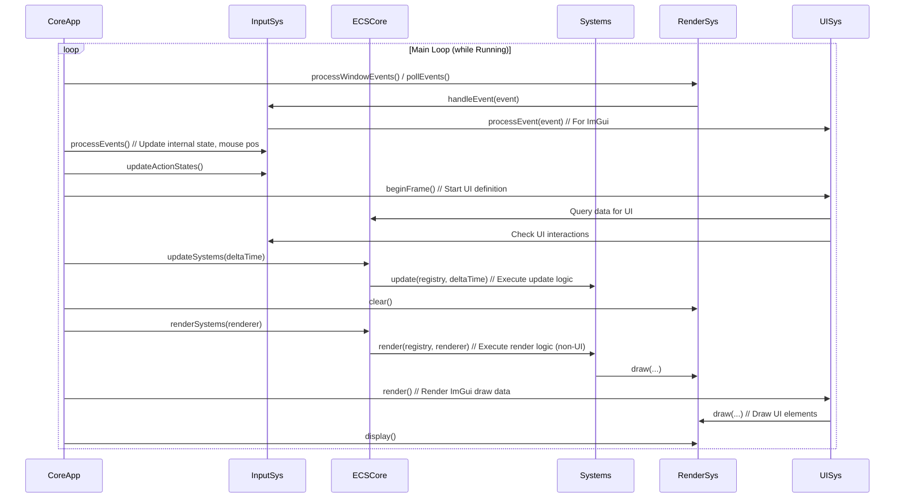

# System Architecture: Transity Simulation

## 1. Overview

The architecture is centered around an **Entity-Component-System (ECS)** pattern, orchestrated by a **Core Application** module. Key responsibilities like rendering, input, configuration, and logging are handled by dedicated, modular systems. This promotes separation of concerns, testability, and scalability.

## 2. Core Modules & Responsibilities

*   **`CoreApplication`**:
    *   Manages the application lifecycle (initialization, main loop, shutdown).
    *   Orchestrates the initialization and shutdown of all other core systems.
    *   Runs the main game loop, coordinating input processing, simulation updates, and rendering.
*   **`ECSCore` (using EnTT)**:
    *   Manages the ECS registry (entities, components).
    *   Provides interfaces for creating/destroying entities and adding/removing/querying components.
    *   Executes registered systems (Update & Render) based on component views.
*   **`RenderingSystem` (using SFML)**:
    *   Manages the application window and graphics context.
    *   Handles view/camera management (position, zoom).
    *   Provides drawing primitives and coordinate mapping functions.
    *   Polls and potentially forwards window-specific events (resize, close).
    *   (Potentially integrates with ImGui for rendering UI).
*   **`InputSystem`**:
    *   Processes raw input events (keyboard, mouse) received from `RenderingSystem` or polled directly.
    *   Manages input state (key/button pressed/down/released).
    *   Handles input mapping (raw input to game actions).
    *   Manages ImGui input capture focus (ensuring UI or game receives input).
*   **`ConfigSystem`**:
    *   Loads and provides access to application configuration data (e.g., window settings, key bindings, simulation parameters).
*   **`LoggingSystem`**:
    *   Provides a centralized interface for logging application events, warnings, and errors.
*   **`ResourceManager` (Proposed)**:
    *   Manages loading, unloading, and access to game assets (textures, fonts, sounds, shaders). Prevents redundant loading and centralizes resource lifetimes.
*   **`UISystem` (Proposed, using ImGui)**:
    *   Manages the creation and rendering of user interface elements (menus, buttons, info panels).
    *   Interacts with `InputSystem` for UI input handling.
    *   Interacts with `RenderingSystem` to draw the UI.
    *   Interacts with `ECSCore` or other systems to display game state or trigger actions.
*   **Simulation Systems (Specific ECS Systems)**:
    *   Implement game logic by operating on entities with specific components (e.g., `VehicleMovementSystem`, `PassengerGenerationSystem`, `LineDrawingSystem`, `StationRenderSystem`). These are registered with `ECSCore`.
*   **Components (Specific ECS Components)**:
    *   Plain data structures holding state for entities (e.g., `PositionComponent`, `VehicleComponent`, `PassengerComponent`).

## 3. Architecture Diagrams (Mermaid)

**a) High-Level Component Diagram:**

```mermaid
graph TD
    subgraph Core Systems
        CoreApp[CoreApplication]
        ECSCore[ECSCore (EnTT)]
        RenderSys[RenderingSystem (SFML)]
        InputSys[InputSystem]
        ConfigSys[ConfigSystem]
        LogSys[LoggingSystem]
        ResMgr(ResourceManager)
        UISys(UISystem (ImGui))
    end

    subgraph ECS Elements
        Components[Components (...Component.spec.md)]
        Systems[Simulation Systems (...System.spec.md)]
    end

    CoreApp --> ECSCore
    CoreApp --> RenderSys
    CoreApp --> InputSys
    CoreApp --> ConfigSys
    CoreApp --> LogSys
    CoreApp --> ResMgr
    CoreApp --> UISys
    CoreApp --> Systems

    RenderSys --> ConfigSys
    RenderSys --> LogSys
    RenderSys --> ResMgr
    RenderSys -- Window Events --> InputSys
    RenderSys -- Draw UI --> UISys

    InputSys --> RenderSys  // Needs window ref, coord mapping
    InputSys --> ConfigSys  // Key bindings
    InputSys --> LogSys
    InputSys -- UI Input --> UISys

    UISys --> InputSys // Check input capture
    UISys --> RenderSys // Request drawing
    UISys --> ResMgr // UI Assets
    UISys --> ECSCore // Display data / Trigger actions

    Systems --> ECSCore
    Systems --> LogSys
    Systems --> ResMgr // Game Assets
    Systems --> RenderSys // Render Systems request drawing

    ECSCore --> Components
    ECSCore --> Systems
    ECSCore --> LogSys

    ResMgr --> LogSys
    ConfigSys --> LogSys

    style ResMgr fill:#f9d,stroke:#333,stroke-width:2px
    style UISys fill:#f9d,stroke:#333,stroke-width:2px
```

**b) Simplified Game Loop Sequence Diagram:**



## 4. Key Architectural Aspects

*   **Modularity:** High. Each system has distinct responsibilities. ECS further separates data (Components) from logic (Systems).
*   **Scalability:** Good. New features can be added via new Components and Systems with minimal impact on existing ones. Performance scaling depends on efficient System implementation and potential optimizations (culling, fixed timestep as mentioned in specs). `ResourceManager` aids asset scalability.
*   **Security:** Standard for an offline application. Focus on safe handling of configuration files and potentially input validation if user-generated content were ever added. No network features specified.
*   **Testability:** Good. Individual systems and components can be unit-tested. ECS systems can be tested by setting up specific entity/component states in the registry.

## 5. Proposed Directory Structure

```
.
├── architecture/
│   ├── system_architecture.md  <-- This file
│   └── (Other diagrams/docs as needed)
├── specs/
│   ├── components/
│   ├── systems/
│   └── ... (Core spec files)
├── src/
│   ├── components/
│   ├── systems/
│   ├── core/             <-- CoreApplication, ECSCore, etc.
│   ├── rendering/        <-- RenderingSystem
│   ├── input/            <-- InputSystem
│   ├── config/           <-- ConfigSystem
│   ├── logging/          <-- LoggingSystem
│   ├── resources/        <-- ResourceManager
│   ├── ui/               <-- UISystem
│   └── main.cpp          <-- Entry point
├── assets/
│   ├── textures/
│   ├── fonts/
│   └── ...
└── ... (Build files, etc.)